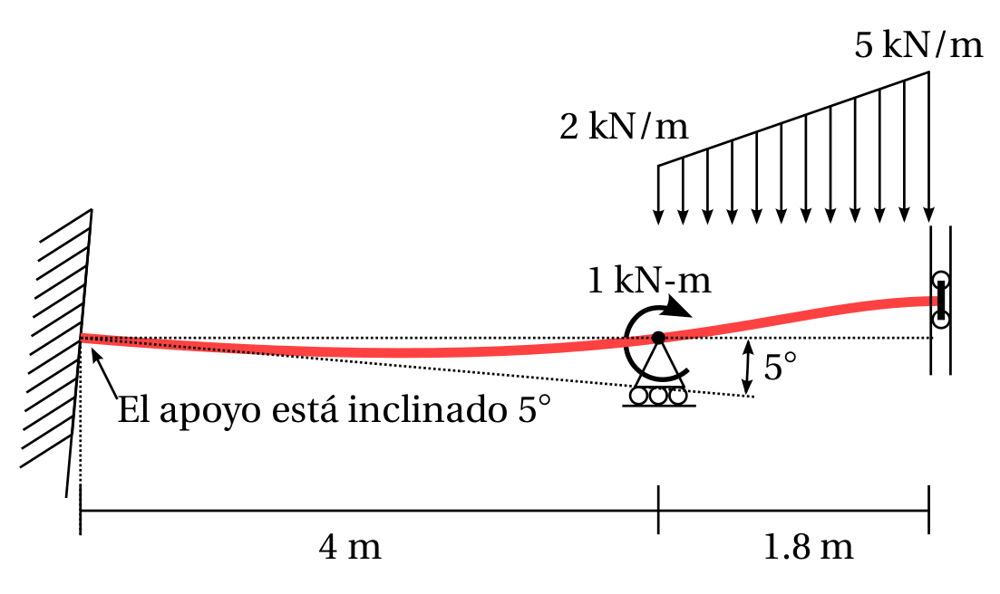

# Análisis Estructural

 

## Cursos

En la [Universidad Nacional de Colombia sede Manizales](https://www.manizales.unal.edu.co/):

- **4100704 - Análisis Estructural Básico (G1)**

| Profesor                          | Michael Heredia Pérez, [mherediap@unal.edu.co](mherediap@unal.edu.co)       |
| ---                               | ---                                                                         |
| Semestre en curso                 | 2023b, 16 semanas                                                           |
| [Créditos](informacion/credito.md)| 4                                                                           |
| Horario                           | martes (4:00 p.m. - 6:00 p.m.) y jueves (4:00 p.m. - 6:00 p.m.)             |

## Índice

0. [Prerrequisitos](informacion/00--prerrequisitos.md)
1. [Contenido de la asignatura](informacion/01--contenido-analisis-basico.md)
2. [Bibliografía y material recomendado](02--bibliografia-material.md)
3. [Calificación y evaluación](informacion/03--calificacion.md)
4. [Recomendaciones para estudiar](informacion/04--recomendaciones-para-estudiar.md)
5. [Presentaciones de clase](diapos/readme.md)

Adicionalmente, en estos repositorios se encuentra información relevante:

* Medio continuo: <https://github.com/michaelherediaperez/medio_continuo>
* Elementos finitos: <https://github.com/diegoandresalvarez/elementosfinitos>

## Descargar el material

Se puede clonar el repositorio usando:

    git clone https://github.com/michaelherediaperez/analisis-estructural.git

o directamente usar la opción de descarga desde GitHub.
